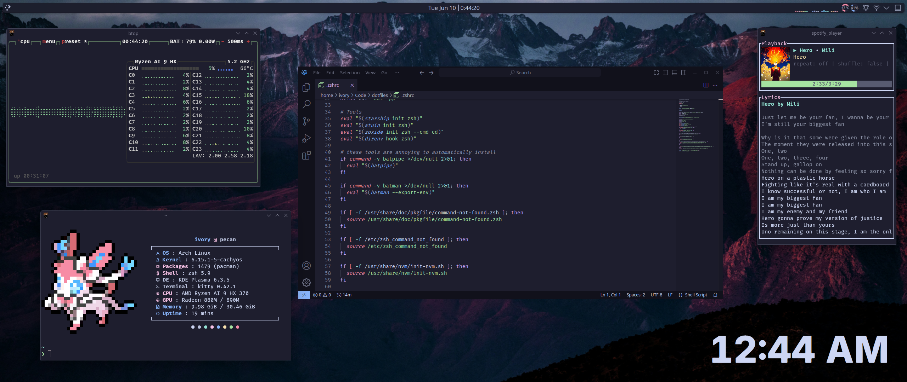

# Sylvia's dotfiles

[It just works™](https://www.youtube.com/watch?v=nVqcxarP9J4)



## Installation

There is about a 50% chance this works for you, it works for me though.

```zsh
$ ./install
```

## Applications

* KDE/Plasma
* Espanso
* Fastfetch
* Kitty
* VSCodium

## Tools

* zsh
* eza
* bat
* starship
* atuin
* zoxide
* carapace
* direnv
* bat-extra (optional)
* pkgfile (optional, arch)
* command-not-found (optional, debian/ubuntu)
